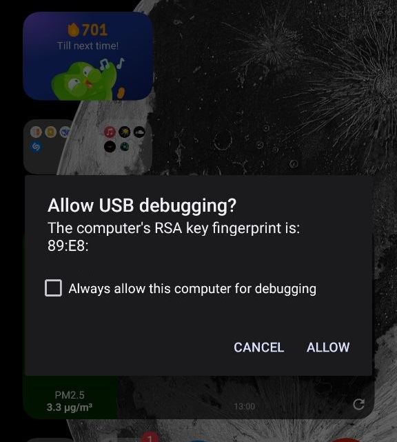
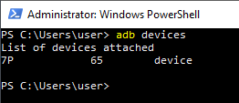
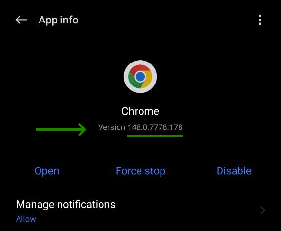
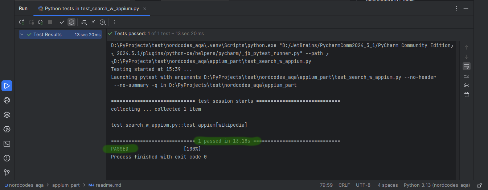

# Предупреждения и ограничения
- Выбираемая позиция выпадающего списка вариантов поиска выставлена в величинах относительно разрешения экрана телефона (x: 1080//2, y: 2400//4) 

Инструкция была написана для следующего решения.

| Наименование     | ПК          | X | Наименование           | Смартфон                                              |  
|------------------|-------------|---|------------------------|-------------------------------------------------------|
| ОС               | Windows 10 x64 | X | ОС                     | Android 12                                            |
| IDE              | PyCharm     | X | Название модели        | Realme 10 / RMX3630                                   |
| Командная строка | Powershell  | X | Разрешение экрана      | 1080 х 2400                                           |
| SDK android      | Установлен вручную | X | Спецификация смартфона | [ссылка](https://www.gsmarena.com/realme_10-11950.php) |
| Версия appium    |             | X | Версия Chrome          | 148.0.X                                               |

# Инструкция 
## Шаг 0 - Настройка окружения

### Android Software development kit
1. Скачать SDK command line tool - [developer.android.com/studio#command-line-tools-only](https://developer.android.com/studio#command-line-tools-only)
2. Разархивировать SDK CLT в удобную директорию. Пусть это будет `C:\android_sdk\cmdline-tools`. Создать в ней папку latest и переместить туда содержимое этой же папки.
3. Чрез командную строку запустить команду на установку необходимых компонент - [developer.android.com/tools/sdkmanager](https://developer.android.com/tools/sdkmanager)
`C:\android_sdk\cmdline-tools\latest\bin\sdkmanager.bat --sdk_root=C:\android_sdk "platform-tools" "platforms;android-35" "build-tools;35.0.0"`
4. В настройках windows для переменной окружения  
4.1. Для Path добавить новые пути-ассоциации: 
`C:\android_sdk\platform-tools`
`C:\android_sdk\cmdline-tools\latest\bin`  
4.2. Добавить новые системные переменные
`ANDROID_HOME` и `ANDROID_SDK_ROOT` со значением `C:\android_sdk`

### Установка пакетов проекта
1. Создать проект в PyCharm
2. Разместить в проекте список необходимых модулей
3. Установить их через terminal в PyCharm - [requirements-appium.txt](requirements-appium.txt)  
`pip install -r requirements-appium.txt`

### Установка appium и драйвера к нему
1. Установить node.js, установив файл с официального сайта - [nodejs.org](https://nodejs.org/en/download)
2. Установить appium через командную строку - [appium.io](https://appium.io/docs/en/3.4/quickstart/install/)  
`npm install appium`
3. Установить драйвер для appium через командную строку - [appium.io/uiauto2-driver](https://appium.io/docs/en/3.4/quickstart/uiauto2-driver/#standard-install)   
`appium driver install uiautomator2`

## Шаг 1 - настройка android-смартфона
1. Включить developer mode:   
`Settings → About Phone → нажать 7 раз по "Build number"`
2. Настроить дебагинг через USB:  
`Settings → Developer options → USB debugging ON `
3. Подключиться через usb к компьютеру, откуда будет реализована автоматизация. Разрешить USB-debugging.

4. Проверить, что телефон отображается у adb

## Шаг 2 - запуск автоматизации
Выберите вариант для шага №2 (рекомендую вариант №2).  
Выставите соответствующий флаг в аргумент тест-функции. Необходимый флаг указан в заголовке варианта.

### Вариант 1 / manual_chromedriver:bool=False
0. Проверить правильность флага из заглавия варианта в аргументах тест-функции.
1. Запустить appium в командной строке
`appium --allow-insecure=uiautomator2:chromedriver_autodownload`
2. Запустить скрипт [test_search_w_appium.py](test_search_w_appium.py)
При первом запуске возможно длительное ожидание исполнение скрипта, это связанно с установкой подходящего chromedriver под Chrome смартфона. 
Актуальный статус установки необходимой компоненты можно отследить в командной строке.
Если получаете ошибку с размещением хром-драйвера, тогда необходимо перейти к варианту 2 данного шага.

### Вариант 2 /  manual_chromedriver:bool=True
0. Проверить правильность флага из заглавия варианта в аргументах тест-функции.
1. Если ваш а версия Chrome 148.0.., переходите к следующему пункту.  
Версию браузера можно посмотреть через телефон на странице информации о приложении.   
  

    1.1. Если ваш Chrome не 148, то необходимо скачать хром-драйвер, предлагаемый Goggle [[googlechromelabs/chrome-for-testing](https://googlechromelabs.github.io/chrome-for-testing/)] 
и разместить в соответсвующей директории проекта [[chromedriver](chromedriver)].
Если ваша версия не совпадает с предлагаемыми - необходимо скачать соответсвующую версию из открытых источников\магазина, которым пользуетесь.
3. Запустить appium в командной строке  
`appium`
3. Запустить скрипт [test_search_w_appium.py](test_search_w_appium.py)

## Шаг 3 - анализ результата тестирования
1. Дождаться резултьата тестирования в Run-вкладке PyCharm
Пример исполнения

2. Если результат отличный от Passed - необходимо изучить результат отработки и действовать по ситуации \ сигнализировать автору инструкции.
